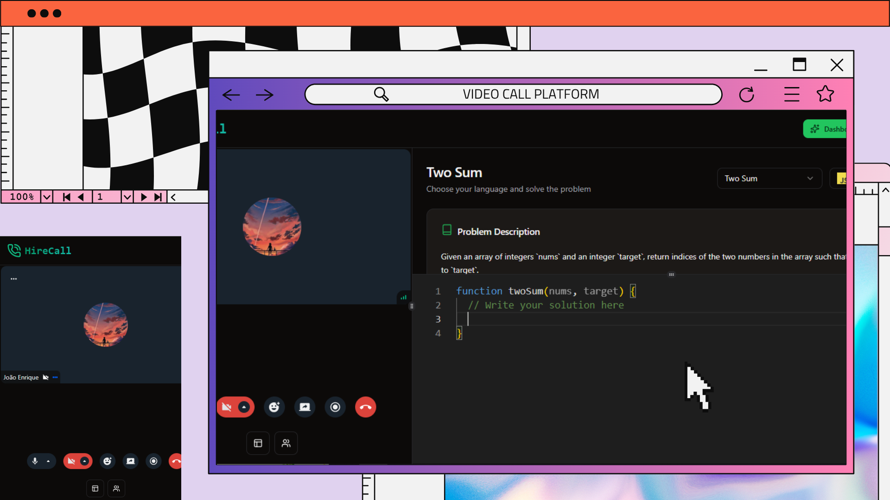
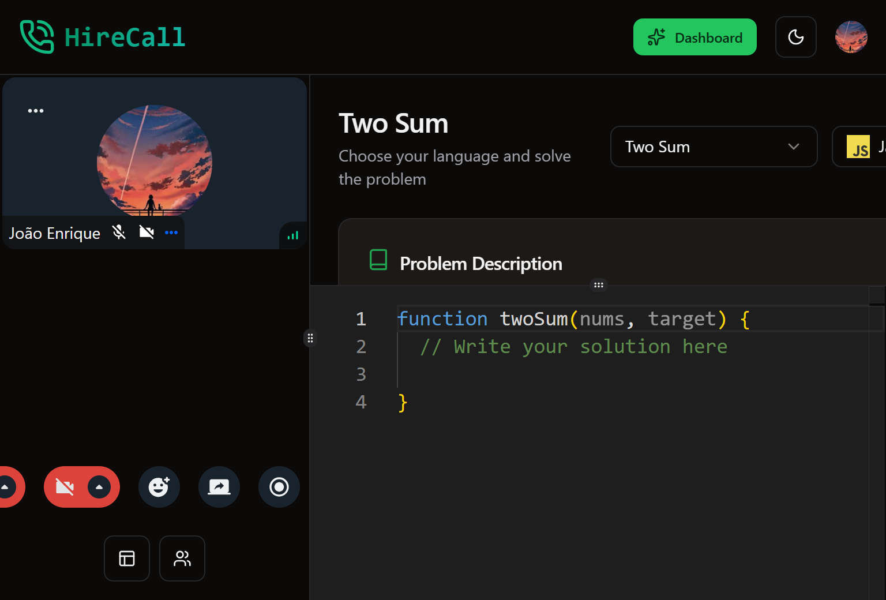
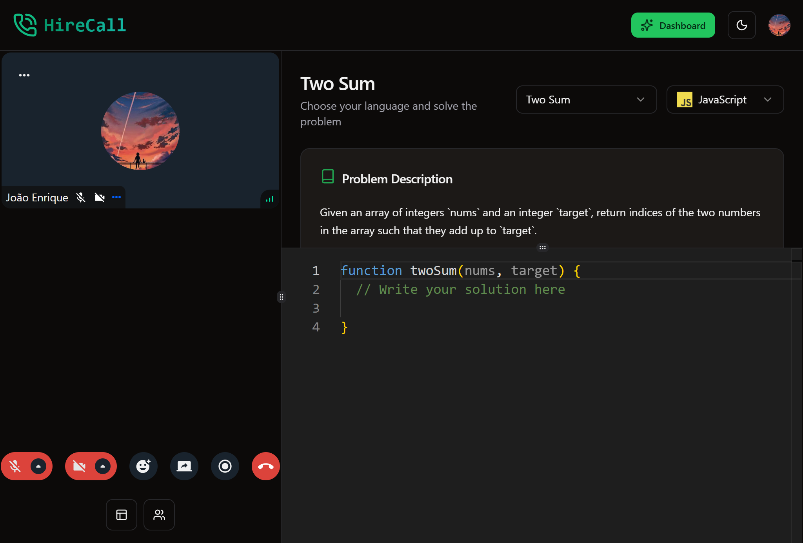
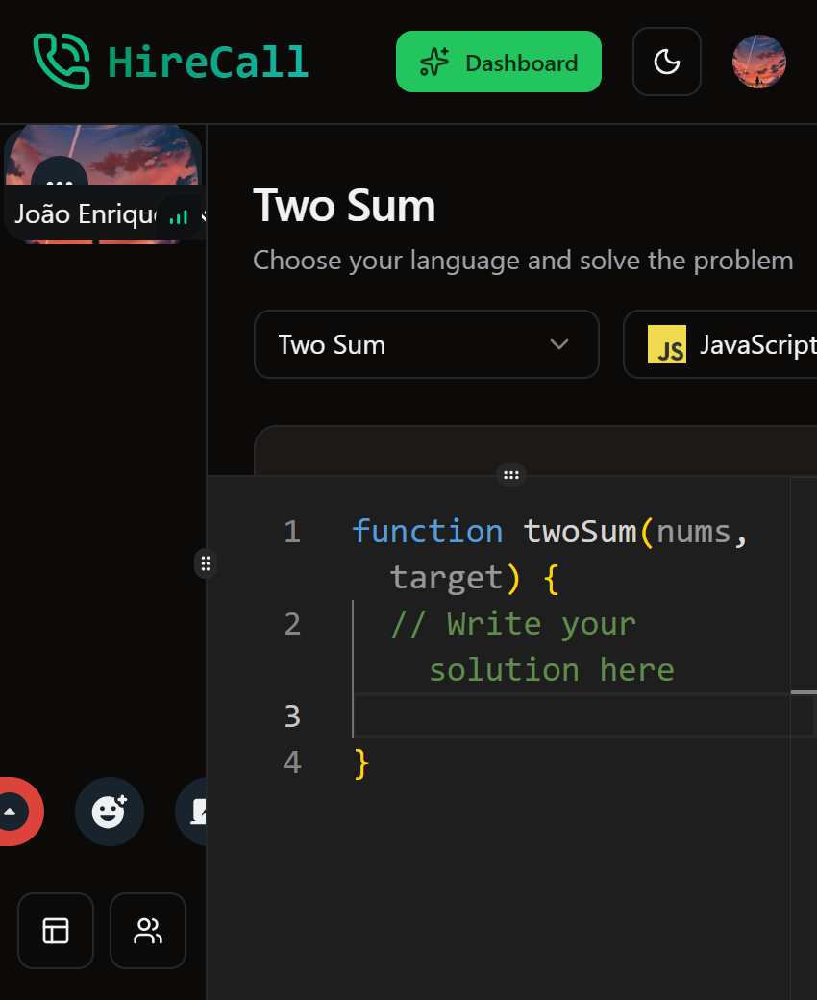

# 💼 Plataforma de entrevista por video chamada
> Uma plataforma de videochamadas moderna, escalável e segura, construída com Convex, React, Next.js e Clerk para autenticação.

---

## 🚀 Demonstração
🔗 **Acesse o projeto:** [link-do-deploy-aqui](https://video-call-platform-liard.vercel.app/)  

📸 **Preview:**  


---

## 📚 Sumário
- [Sobre o Projeto](#-sobre-o-projeto)
- [Tecnologias](#️-tecnologias)
- [Funcionalidades](#-funcionalidades)
- [Como Rodar o Projeto](#-como-rodar-o-projeto)
- [Como Usar](#-como-usar)
- [Screenshots](#️-screenshots)
- [Aprendizados](#-aprendizados)
- [Estrutura de Pastas](#-estrutura-de-pastas)
- [Roadmap](#-roadmap)
- [Links Úteis](#-links-úteis)
- [Autor](#-autor)
- [Licença](#-licença)

---

## 💡 Sobre o Projeto
Esta plataforma de video chamada foi desenvolvido para **recrutadores, avaliar seus candidatos** na área de desenvolvimento.  
A interface foi construída com **React, Nexts e tailwind**, com foco em **design moderno, responsividade e performance**.

O site também inclui **animações sutis e modo escuro**.

---

## 🛠️ Tecnologias
As principais tecnologias utilizadas neste projeto foram:

- **React**
- **Next.js** (Gerenciamento de rotas)
- **Convex** (banco de dados e autenticações de usuários)
- **Clerk** (Login)
- **Tailwind** (estilizações da página)


<div align="right">
  
  
  
  
  
</div>

---

## 📚 Funcionalidades
- [x] Criar e participar de videochamadas
- [x] Salas com múltiplos participantes  
- [x] 🔑 Autenticação segura com **Clerk**
- [x] 💬 Chat em tempo real dentro das salas 
- [x] 📡 Persistência e sincronização com **Convex**  

---

## 📦 Como Rodar o Projeto
Siga as etapas abaixo para executar o projeto localmente:

```bash
    # Crie um arquivo .env.local na raiz do projeto com as variáveis necessárias:
    NEXT_PUBLIC_CLERK_PUBLISHABLE_KEY=...
    CLERK_SECRET_KEY=...
    CONVEX_DEPLOYMENT=...
    NEXT_PUBLIC_CONVEX_URL=...
    NEXT_PUBLIC_STREAM_API_KEY=...
    STREAM_SECRET_KEY=...
```

```bash
# Clone este repositório
git clone https://github.com/joao-enrique/video-call-platform.git

# Acesse a pasta do projeto
cd video-call-platform

# Instale as dependências
npm install
# rode a aplicação
npm run dev
```
A aplicação estará disponivel em: https://localhost:3000
> 💡 Caso não tenha o Node.js instalado, procure no google e siga os passos para sua instalação.

---

## 🧪 Como Usar
1. Instale as dependências com o `node.js`.
2. Navegue pelo projeto.
3. Crie salas e compartilhe ou entre em salas compartilhadas.

---

## 🖼️ Screenshots
### 💻PC

### 📲 Tablet

### 📱 Mobile


---

## 🧠 Aprendizados
Durante o desenvolvimento deste projeto, aprimorei:
- Gerenciamento de rotas com `Next.js`;
- Uso de tailwindCSS (animações, media queries, posicionamentos);
- Uso de estados no `React.js`;
- Melhoria na estrutura de layout responsivo;
- Integração de `convex` para armazenar informações (usuários, salas, mensagens).

---

## 📁 Estrutura de Pastas
├── convex/ </br>
├── public/ </br>
├── src/ </br>
│ ├── actions/ </br>
│ ├── app/ </br>
│ ├── components/ </br>
│ ├── constants/ </br>
│ ├── hooks/ </br>
│ └── lib/ </br>
└── README.md </br>

---

## 🚧 Roadmap
- [] Implementar Mais linguagens de programação para o live coding
- [] Traduzir para versão em português

---

## 🔗 Links Úteis
🌐 Deploy: [link](https://meu-portfolio-lemon-sigma.vercel.app/)  </br>
💼 LinkedIn: [link](https://www.linkedin.com/in/joao-enrique-dev/) </br>
🧠 GitHub: [link](https://github.com/joao-enrique) </br>
🎮 Itch-io: [link](https://jedev1.itch.io/) </br>
📹 YouTube: [link](https://www.youtube.com/@joaocodedev) </br>
✨ Linktree: [link](https://linktree-eight-gules.vercel.app/) </br>

## 👨‍💻 Autor
Feito com 💜 por [João Enrique](https://linktree-eight-gules.vercel.app/)
<div align="right">
  <a href="https://www.linkedin.com/in/joao-enrique-dev/" target="_blank">
    
  </a>
  <a href="https://www.youtube.com/@joaocodedev" target="_blank">
    
  </a>
  <a href="https://jedev1.itch.io/" target="_blank">
    
  </a>
</div>

---

## 📜 Licença
Este projeto está sob a licença **MIT** — veja o arquivo [LICENCE](./LICENSE) para mais detalhes.

### ⭐ Se este projeto te inspirou, não esqueça de deixar uma **estrela** no repositório!