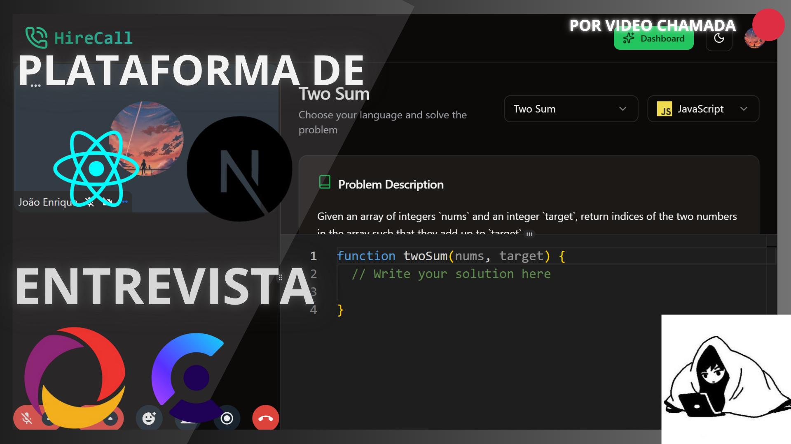
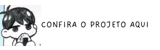
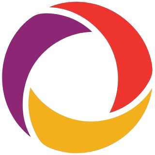
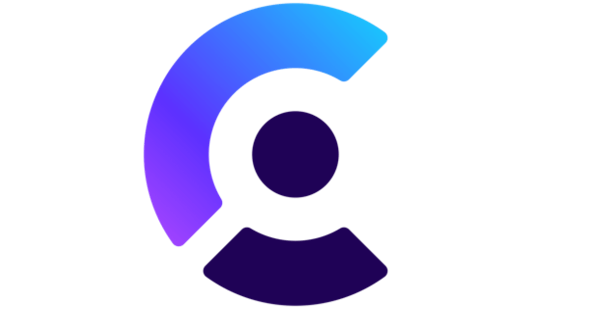

<h1 align="left">🎥 PLATADORMA DE ENTREVISA POR VIDEO CHAMADA ✨</h1>

<div align="center">
    <a href="https://video-call-platform-gbfegyeid-joaos-projects-469c9508.vercel.app/" target="_blank"> 
         
    </a> 
</div>

<div align="center">
    <a href="https://video-call-platform-gbfegyeid-joaos-projects-469c9508.vercel.app/" target="_blank"> 
         
    </a> 
</div>

<p align="left">
  <b>Uma plataforma de videochamadas moderna, escalável e segura, construída com Convex, React, Next.js e Clerk para autenticação.</b>
</p>

---

## 🚀 Tecnologias utilizadas

- 📡 **Convex** → Banco de dados em tempo real e backend serverless  
- ⚛️ **React + Next.js** → Frontend rápido, SSR/SSG e rotas otimizadas  
- 🔑 **Clerk** → Autenticação e gerenciamento de usuários  
- 🎨 **TailwindCSS** → Estilização responsiva e moderna  
- 🎥 **Video Call** → Implementação de salas de chamadas com múltiplos participantes  

<div align="right">
  
  
  
  
  
  
  
</div>

---

## ⚙️ Configuração do ambiente

Crie um arquivo `.env.local` na raiz do projeto com as variáveis necessárias:

```bash
NEXT_PUBLIC_CLERK_PUBLISHABLE_KEY=...
CLERK_SECRET_KEY=...
CONVEX_DEPLOYMENT=...
NEXT_PUBLIC_CONVEX_URL=...
NEXT_PUBLIC_STREAM_API_KEY=...
STREAM_SECRET_KEY=...
```

# ▶️ Como rodar o projeto
### 🔹 Instalar dependências

```bash
npm install
```

### 🔹 Rodar aplicação

```bash
npm run dev
```

A aplicação estará disponível em: http://localhost:3000

# 📂 Estrutura do projeto
├── convex/           # Funções serverless e schemas do Convex</br>
├── src/              # Código da aplicação (React + Next.js) </br>
│   ├── components/   # Componentes reutilizáveis </br>
│   ├── pages/        # Rotas Next.js </br>
│   ├── hooks/        # Hooks customizados </br>
│   └── styles/       # Estilização global </br>
├── public/           # Assets e imagens </br>
├── preview-for-project.png </br>
├── .env.example      # Exemplo de variáveis de ambiente </br>
└── README.md          <- Você está aqui 😁 </br>

# ✅ Funcionalidades

- 🎥 Criar e participar de videochamadas
- 👥 Salas com múltiplos participantes
- 🔑 Autenticação segura com Clerk
- 💬 Chat em tempo real dentro das salas
- 📡 Persistência e sincronização com Convex

# 📜 Licença
Este projeto é open-source sob a licença MIT.</br>
Sinta-se à vontade para usar, modificar e contribuir! 🚀

# 🐱‍💻 Autor
Feito com 💙 por João Enrique.

<div align="right"> 
    <a href="https://www.linkedin.com/in/joao-enrique-dev/" target="_blank"> 
         
    </a> 
    <a href="https://www.youtube.com/@joaocodedev" target="_blank"> 
         
    </a> 
    <a href="https://jedev1.itch.io/" target="_blank"> 
         
    </a> 
    <a href="https://www.instagram.com/joao__dev/" target="_blank"> 
         
    </a> 
    <a href="https://www.tiktok.com/@joao__code" target="_blank"> 
         
    </a> 
</div>